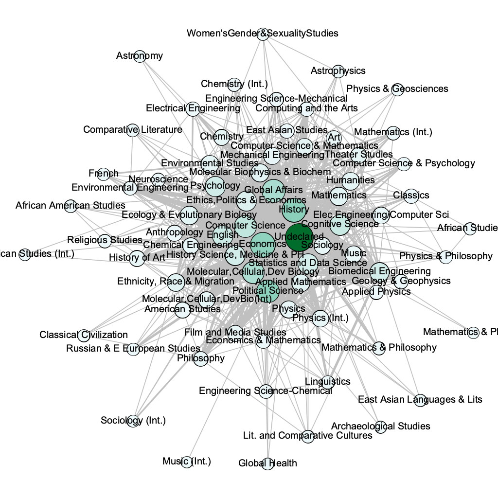

A social network visualization and analysis of Yale University undergraduate student directory data, showing (p&lt;.01) that students who are roommates tend to be majoring in similar diciplines. I show, for example, that engineering students tend to live with other engineering students, or with mathematics or physical science students, and tend not to live with history or philosophy students.

Lance Tan, May 8, 2019

Final term project for Sociology 167 *Social Networks and Society*, Spring 2019

Figure: Visualization of declared majors and roommate relationships in the class of 2021. Each circle is a major at Yale, and bigger circles represent more popular majors. A thicker line between two circles means students in those two majors more frequently room together.

